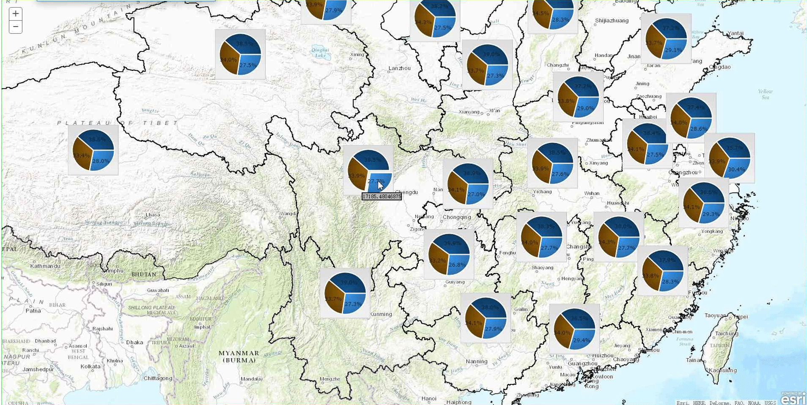
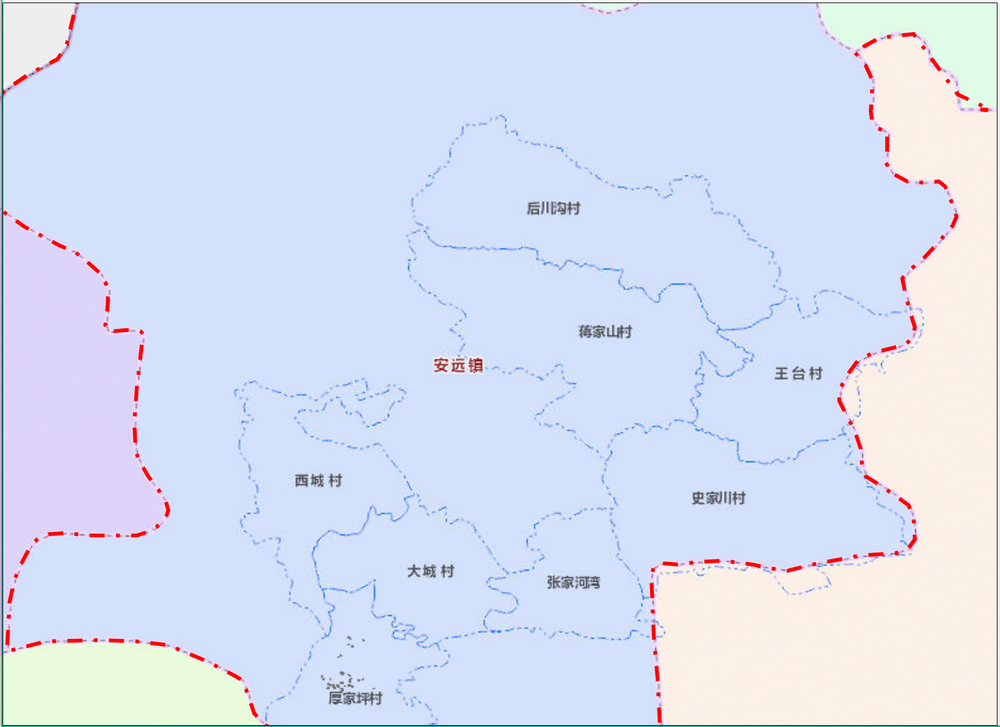

# Charts on Map

> 此库使用ArcGIS API for JavaScript 3.14版本(其他版本未测试，不支持4.0版本)与ECharts，扩展了AGS API ,实现了像在ArcMap中制作统计专题图的效果。

## 效果如下：
### 饼状图:


### 柱状图:


### 结合dojox效果图：

### React+ Echarts+ AGS API

___
## 代码使用
> 1. 配置模块
```JavaScript
var dojoConfig = {
    packages: [{
        name: "CustomModules",
        location: location.pathname.replace(/\/[^/]+$/, "") + "/Widget/CustomModules"
    }]
};
```
> 2. 使用AMD形式加载 `Widget/CustomModules/ChartInfoWindow`中的`ChartInfoWindow.js` 和 `geometryUtils.js`,
```JavaScript
require(["CustomModules/ChartInfoWindow",
         "CustomModules/geometryUtils"], function(ChartInfoWindow, geometryUtils){
            #Coding Here...
         })
```
> 3. 实例化
```JavaScript
require(["CustomModules/ChartInfoWindow",
         "CustomModules/geometryUtils"], function(ChartInfoWindow, geometryUtils){
            #Coding Here...
            #数据处理好之后，处理每一个要素形成一个图标框
            var infoWindow= new ChartInfoWindow({
                /*mainMap -Required*/map:map,
                /*chartNode -Required*/chart: nodeChart,
                /*(x,y,spatialreference) -Required*/chartPoint: labelPt,
                /*float -Optional*/width: 152,
                /*float -Optional*/height: 72
            });
         })
```
